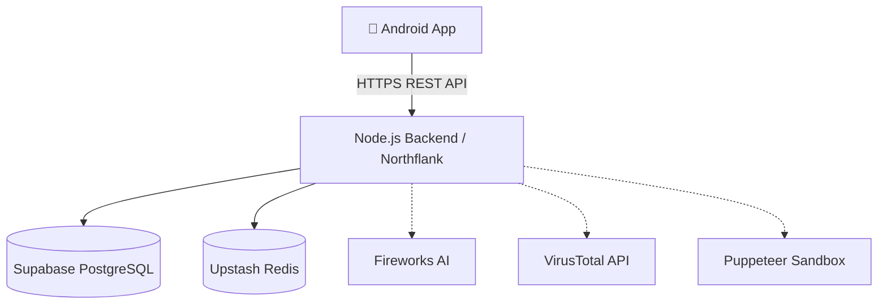

# PhishTrack – Phishing Threat Tracking & Analysis Console


**PhishTrack** is an advanced, open-source **Cyber Security Intelligence and Phishing Detection platform**. Designed for security researchers, SOC analysts, and everyday users, it analyzes malicious domains, tracks phishing campaigns, and generates automated forensic reports in real-time. By leveraging **OSINT (Open Source Intelligence)** and **Generative AI**, PhishTrack provides enterprise-grade threat intelligence through a native Android application and a robust Node.js REST API.

---

## 🚀 Key Features for Threat Intelligence

- **Real-Time Phishing Analysis:** Deep-scan URLs and IPs with zero-latency OSINT (VirusTotal, WHOIS, IP Geolocation, SSL Certificates).
- **Advanced Sandboxing & Fast Ping:** Deploy headless Puppeteer instances to bypass CAPTCHAs, follow malicious redirect chains, and quickly ping IP targets for liveness.
- **Brand Protection & SafeNet:** Utilize Levenshtein distance for Typosquatting/Homograph detection, backed by a deterministic SafeNet Engine that overrides AI verdicts on heavily flagged malware targets.
- **AI-Powered Forensics:** Integrates with Fireworks AI (Llama 3.1) to synthesize raw OSINT data into contextualized threat assessments and extract MITRE ATT&CK techniques.
- **Chain-of-Custody Reporting:** Automatically generates and cryptographically signs PDF forensic reports (SHA-256 HMAC) for legal and incident response teams.
- **Interactive Global Dashboard:** Visualize cyber threats with live MapLibre global radars and GitHub-style weekly heatmaps in a beautiful Dark-Mode UI.
- **Secure Architecture:** Features enterprise-grade JWT authentication, Redis-backed rate limiting, and OTP email verification.

---

## 🛠️ Tech Stack

**Frontend (Android App)**
- Kotlin & Jetpack Compose
- MVVM Architecture & Hilt Dependency Injection
- Retrofit (Networking), DataStore (Preferences)
- Google Maps SDK for Threat Mapping

**Backend (REST API)**
- Node.js & Express.js (Deployed on Northflank)
- Prisma ORM & Supabase (PostgreSQL)
- Redis (Upstash) for Rate Limiting & OTP
- Puppeteer (Headless Chrome Sandbox)
- Fireworks AI (Llama 3.1 Analysis Engine)

---

## 🏗️ System Architecture



---

## 📁 Repository Structure

```text
PhishTrack/
├── PhishTrack/               # Native Android Application (Kotlin/Compose)
├── phishtrack-backend/       # Node.js REST API & AI microservices
├── docs/                     # Development plans, audits, and UI/UX notes
├── README.md                 # Project documentation
└── .gitignore                # Global ignore rules
```

---

## 💻 Getting Started

### Prerequisites
- Node.js v18+ and npm
- Java JDK 17
- Android Studio Ladybug (or higher)

### 1. Backend Setup
```bash
cd phishtrack-backend
npm install

# Copy environment template
cp .env.example .env

# Generate Prisma Client & Push DB Schema
npx prisma generate
npx prisma db push

# Start the dev server
npm run dev
```

### 2. Android Setup
1. Open the `PhishTrack` folder in Android Studio.
2. Let Gradle sync and resolve all dependencies.
3. In `ApiService.kt`, ensure `BASE_URL` points to your backend instance.
4. Run the app on an Android Emulator (API 26+).

---


## 🛡️ Disclaimer

*PhishTrack is designed for authorized cybersecurity investigations, research, and defensive analysis. Use responsibly and ensure compliance with local laws.*
