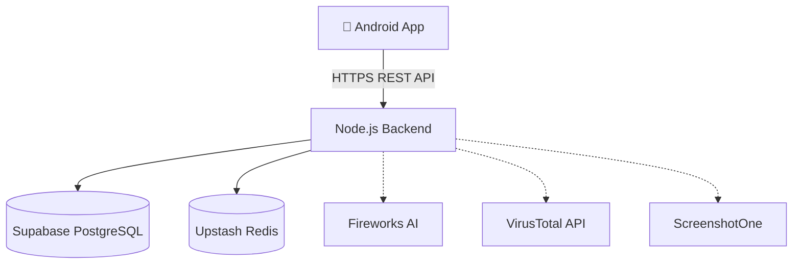

# 🎣 PhishTrack


**PhishTrack** is an advanced, AI-powered Cyber Security Intelligence platform designed to analyze, track, and report on phishing campaigns and malicious domains in real-time. It features a native Android application paired with a robust Node.js backend.

---

## 🚀 Features

- **Real-Time Threat Analysis:** Analyzes URLs and IPs using AI and OSINT tools (Whois, IP Geo, SSL Certificates).
- **AI-Powered Assessments:** Integrates with Fireworks AI for deep forensic evaluations and MITRE ATT&CK technique mapping.
- **Forensic Reporting:** Automatically generates and signs cryptographically secure PDF reports for chain-of-custody preservation.
- **Interactive Dashboard:** Global heatmaps and weekly scan analytics presented in a beautiful, modern Dark-Mode UI.
- **Secure Authentication:** Features JWT-based authentication with OTP email verification.

---

## 🛠️ Tech Stack

**Frontend (Android App)**
- Kotlin & Jetpack Compose
- MVVM Architecture & Hilt Dependency Injection
- Retrofit (Networking), DataStore (Preferences)
- Google Maps SDK for Threat Mapping

**Backend (REST API)**
- Node.js & Express.js
- Prisma ORM & Supabase (PostgreSQL)
- Redis (Upstash) for Rate Limiting & OTP
- Puppeteer (Headless Chrome Sandbox)
- Fireworks AI (LLM Analysis Engine)

---

## 🏗️ System Architecture



---

## 📁 Repository Structure

```text
PhishTrack/
├── PhishTrack/               # Native Android Application (Kotlin/Compose)
├── phishtrack-backend/       # Node.js REST API & AI microservices
├── docs/                     # Development plans, audits, and UI/UX notes
├── README.md                 # Project documentation
└── .gitignore                # Global ignore rules
```

---

## 💻 Getting Started

### Prerequisites
- Node.js v18+ and npm
- Java JDK 17
- Android Studio Ladybug (or higher)

### 1. Backend Setup
```bash
cd phishtrack-backend
npm install

# Copy environment template
cp .env.example .env

# Generate Prisma Client & Push DB Schema
npx prisma generate
npx prisma db push

# Start the dev server
npm run dev
```

### 2. Android Setup
1. Open the `PhishTrack` folder in Android Studio.
2. Let Gradle sync and resolve all dependencies.
3. In `ApiService.kt`, ensure `BASE_URL` points to your backend instance.
4. Run the app on an Android Emulator (API 26+).

---

## 📸 Screenshots

*(Replace these placeholders with actual screenshots from your Android device)*

<div align="center">
  
  &nbsp;&nbsp;&nbsp;&nbsp;
  
  &nbsp;&nbsp;&nbsp;&nbsp;
  
</div>

---

## 🛡️ Disclaimer

*PhishTrack is designed for authorized cybersecurity investigations, research, and defensive analysis. Use responsibly and ensure compliance with local laws.*
