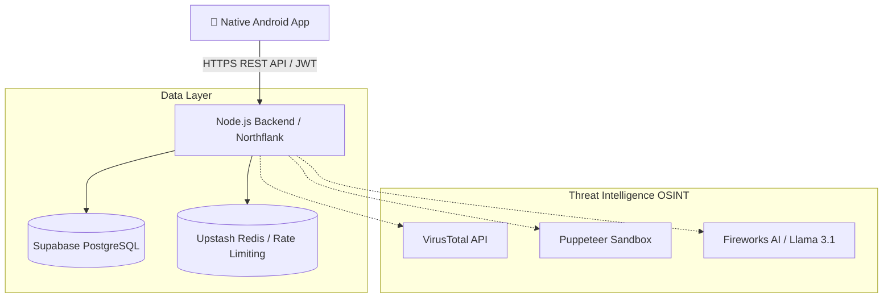

<div align="center">
  <h1 align="center">PhishTrack</h1>
  <p align="center">
    <strong>Advanced Cyber Security Intelligence & Phishing Detection Platform</strong>
  </p>
  <p align="center">
    
    
    
    
  </p>
</div>

---

**PhishTrack** is an enterprise-grade, OSINT-powered digital forensics platform engineered for security researchers, SOC analysts, and everyday users. It is designed to instantly dissect, analyze, and report on phishing campaigns, malicious domains, and rogue IP infrastructure. By combining zero-latency open-source intelligence with advanced Generative AI and headless sandboxing, PhishTrack delivers contextualized threat intelligence directly to a native Android application.

---

## 🎯 Core Capabilities

- **Zero-Latency Threat Engine:** Simultaneously queries VirusTotal, WHOIS databases, IP Geolocation networks, and SSL Certificate authorities for instantaneous threat data.
- **Brand Protection & Typosquatting:** Utilizes Levenshtein distance and Punycode analysis algorithms to detect sophisticated brand impersonation and homograph attacks.
- **Puppeteer Sandboxing & Fast Ping:** Deploys headless browser instances to safely bypass CAPTCHAs, extract DOM footprints, and follow malicious redirect chains without endangering the analyst. Fast Ping ensures rapid liveness checks on IP targets.
- **AI-Powered Threat Synthesis:** Integrates with Fireworks AI (Llama 3.1) to synthesize raw, chaotic OSINT data into actionable threat intelligence, automatically extracting MITRE ATT&CK techniques.
- **Deterministic SafeNet Engine:** Automated failsafes that instantly override AI hallucinations or benign verdicts when severe heuristics (e.g., 5+ VirusTotal engines) confidently flag a target as malware.
- **NIST-Aligned Forensics:** Automatically generates detailed, immutable PDF forensic reports for legal and incident response teams. Each report is cryptographically signed using a SHA-256 HMAC and stored securely on Supabase.
- **Interactive Global Radar:** Visualizes cyber threats with live MapLibre global radars and GitHub-style weekly heatmaps within a beautiful, data-dense Dark-Mode UI.

---

## 🏗️ Technical Architecture

PhishTrack employs a modern, decoupled microservice architecture, leveraging the best of native mobile development and scalable cloud infrastructure.



### 💻 Tech Stack Highlights
* **Frontend:** Kotlin, Jetpack Compose, MVVM Architecture, Hilt (DI), Retrofit, MapLibre.
* **Backend:** Node.js, Express.js, Prisma ORM, deployed globally on Northflank.
* **Storage & Caching:** Supabase (PostgreSQL / Blob Storage), Upstash Redis (OTP & Rate Limiting).
* **Security:** Enterprise-grade JWT authentication, Redis-backed brute-force prevention, and SHA-256 HMAC hashing.

---

## 🚀 Getting Started

### Prerequisites
* **Node.js** (v18+)
* **Java JDK 17** & **Android Studio Ladybug**

### 1. Backend Deployment
```bash
# Clone and enter the backend directory
cd phishtrack-backend
npm install

# Configure environment variables (Supabase, Upstash, Fireworks, VT)
cp .env.example .env

# Generate Prisma Client & Sync Schema
npx prisma generate
npx prisma db push

# Launch the API server
npm run dev
```

### 2. Android Client Setup
1. Open the `PhishTrack` folder in **Android Studio**.
2. Allow Gradle to sync and resolve all dependencies.
3. Open `ApiService.kt` and ensure the `BASE_URL` points to your Northflank deployment (or `localhost` if testing via emulator).
4. Build and run the app on any device running API 26 or higher.

---

## 🛡️ Legal & Ethical Disclaimer

*PhishTrack is engineered strictly for authorized cybersecurity investigations, academic research, and defensive threat analysis. The developers assume no liability for misuse. Always ensure compliance with local and international cyber laws when interacting with live malicious infrastructure.*

<div align="center">
  <sub>Final Internship Submission // Case File: PhishTrack-2026 // End of Report</sub>
</div>
